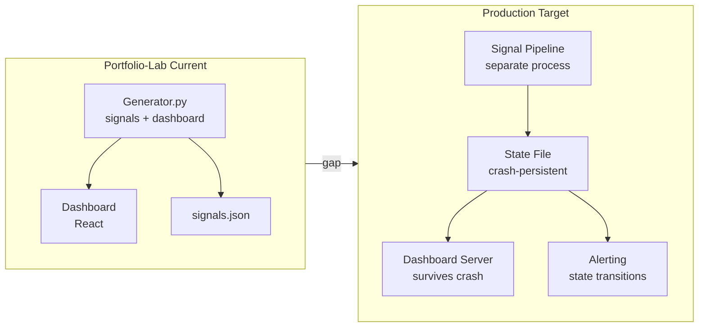

# Portfolio-Lab Production Readiness Deep Research (2026-05-26) -- Refined

## TL;DR

1. **Regime definition validation is the hardest unsolved problem** -- academic literature warns of "definitional chaos" in market regime classification; portfolio-lab's RECOVERY/LOW_VOL validation is ahead of the curve but needs formal out-of-sample testing
2. **Staleness-weighted ensemble voting** is the highest-ROI production improvement -- stale signals should degrade weights proportionally, not just be reported
3. **Dashboard-pipeline separation** is the biggest architectural gap -- production trading systems run dashboard and signal pipeline as separate processes; portfolio-lab bundles them
4. **Regime hysteresis** prevents rapid signal toggling -- add confidence thresholding and transition cooldowns to RegimeGate
5. **Statistical Process Control** on signal distributions detects degradation before it hits P&L

## Overview

Portfolio-lab implements several production best practices: signal staleness detection (4h TTL), PASS->WARN->HALT webhook alerting, GARCH->EWMA->historical fallback chain, LTTB downsampling, and dynamic regime-based gating. The main gaps are architectural: no dashboard-signal pipeline separation (see Architecture Comparison below), no container-level crash strategy, no interactive repair console, and no trade repair tracking. Signal quality monitoring lacks SPC and staleness-weighted voting.

## Architecture Comparison

## Findings

### Production Infrastructure

- **Trading Strategy trade-executor**: `/status` JSON endpoint, separate web server process surviving main loop crashes, Docker health checks intentionally NOT auto-restarting, trade repair with provenance tracking
- **PASS->WARN->HALT escalation** confirmed as industry standard for trading system alerting
- **Crash resilience pattern**: main loop crashes -> web server stays up -> state file preserved -> interactive Python console available for repairs

### Signal Pipeline & Regime Gating

- **"Fresh Data, Stale Signals"** (SSRN): stale data inputs degrade market anomaly signals; standard portfolio metrics fail to distinguish stale-driven returns from genuine edges
- **"What Are Market Regimes?"** (SSRN): field lacks consistent regime definition -- direct caution for production gating
- **Signal staleness alerting**: threshold at 2x normal refresh interval (portfolio-lab uses 4h TTL; should also add 2x = 8h HALT alert)
- **Statistical Process Control (SPC)**: Shewhart control charts with 3-sigma limits auto-detect distribution shifts
- **Regime hysteresis**: confidence thresholding (70% to gate OFF) + cooldown periods preventing ON/OFF oscillation near boundaries
- **Ensemble-HMM Voting** (UCL thesis): multiple weak regime detectors combined into single confident classification -- closest academic analog to RegimeGate
- **RegimeNAS** (arXiv): regime-aware neural modules with Lipschitz stability constraints preventing abrupt switching

### Quant Testing

- **Property-based testing** (Hypothesis): generates edge cases humans miss (zero prices, extreme volatilities, empty portfolios)
- **Test pyramid**: 70% unit / 20% integration / 10% end-to-end for quant systems
- **Walk-forward as integration test**: validates full pipeline, not isolated metrics
- **Backtest replay testing**: record signals from production, replay through backtest, compare outputs -- catches silent signal changes
- **Session-scoped fixtures with importorskip**: avoids repeated import attempts for optional deps

## Verification Methods

1. **Regime validation**: run walk-forward validation (20+ windows) comparing regime classifier accuracy vs buy-and-hold; portfolio-lab already has WFE=1.02 from 20-window validation
2. **Staleness-weighted voting**: add `staleness_age_hours` to signal readings, apply `weight *= exp(-age / tau)` with tau=2h; signals beyond 4h receive near-zero weight
3. **SPC monitoring**: track rolling mean/variance of each signal stream; flag when 3-sigma breach holds for 3+ consecutive periods
4. **Dashboard separation**: extract dashboard into separate Flask app reading from `signals.json`; generator writes state file, dashboard reads read-only
5. **Hysteresis**: add `regime_confidence` to regime_log; gate signals OFF only when confidence > 0.7; enforce 5-day cooldown after regime transitions

## Analysis

### Already Implemented (Strengths)

- Signal staleness detection with 4h TTL
- PASS->WARN->HALT webhook alerting
- GARCH->EWMA->historical fallback chain
- LTTB downsampling for long chart ranges
- Dynamic regime-based gating (TSMOM)
- pytest importlib mode
- Walk-forward validation (WFE=1.02, 20 windows)
- Deflated Sharpe Ratio (DSR=0.979)

### Highest-ROI Gaps (Priority Order)

1. **Staleness-weighted ensemble voting** (2h, MEDIUM impact) -- degrade stale signal weights via exponential decay by age
2. **Regime hysteresis** (3h, MEDIUM impact) -- confidence thresholding + cooldowns prevent regime oscillation
3. **YFinance memoization** (1-2h, HIGH impact) -- behavioral_sentiment_fetcher makes 8 `yf.Ticker().history()` calls per snapshot
4. **SPC on signal distributions** (4h, MEDIUM impact) -- Shewhart control charts detect degradation before P&L impact
5. **Dashboard-pipeline separation** (1-2 days, HIGH impact) -- architectural change for crash resilience

### Academic Cautions

- "What Are Market Regimes?" warns regime definitions lack standardization -- portfolio-lab's RECOVERY regime (5.5% detection, Sharpe 4.17) needs continued OOS validation
- Equal-weight ensembles often outperform complex weighting OOS -- be cautious with adaptive weighting
- Finance signal-to-noise ratios are extremely low (~0.03 daily Sharpe) -- degradation detection requires long evaluation windows

## Sources

1. Trading Strategy trade-executor -- github.com/tradingstrategy-ai/docs
2. SSRN "Fresh Data, Stale Signals" -- papers.ssrn.com/sol3/papers.cfm?abstract_id=6605078
3. SSRN "What Are Market Regimes?" -- papers.ssrn.com/sol3/papers.cfm?abstract_id=6493762
4. RegimeNAS (arXiv 2508.11338) -- arxiv.org/abs/2508.11338
5. UCL Thesis "Ensemble-HMM Voting" -- discovery.ucl.ac.uk/id/eprint/10202690/
6. Context7 pytest documentation -- docs.pytest.org
