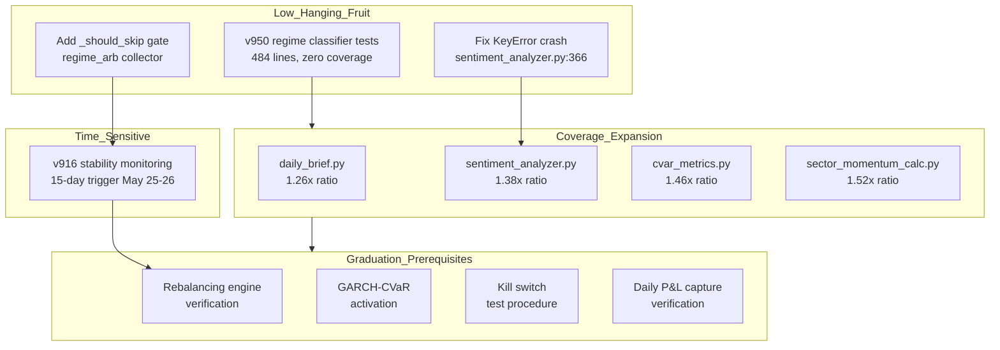

# Deep Research: portfolio-lab Highest-Impact Next Actions

## TL;DR

- **v916 stability monitoring** triggers May 25-26 (15 trading days) — most time-sensitive action
- **v950 regime classifier tests** are lowest-effort, highest-confidence: 484 lines, zero tests, pure numpy
- **4 modules have thin test coverage** (daily_brief 1.26x, sentiment_analyzer 1.38x, cvar_metrics 1.46x, sector_momentum_calc 1.52x) — sentiment_analyzer has a hidden KeyError crash
- **Cross-Asset Regime Arbitrage collector lacks `_should_skip()` gate** — always invoked even with zero weight
- **Graduation readiness at 37.5%** — needs rebalancing verification, GARCH-CVaR activation, kill switch testing
- **TSMOM standalone (0.96 Sharpe) beats combined overlays (0.93)** — hardening what exists beats adding signals

## Findings

### 4 Weakest Coverage Modules

**1. daily_brief.py (1.26x ratio)** — untested paths: DSR < 0.50 severity flip, `--save` CLI branch, `--no-narrative` flag, BL weight absence, `overlay_status` with non-dict overlays.

**2. sentiment_analyzer.py (1.38x ratio)** — **KeyError crash at line 366**: `load_sentiment_history()` catches `(IOError, OSError, json.JSONDecodeError)` but NOT `KeyError`, which fires when JSON lacks "timestamp" key. Also untested: `aggregate_sources()` with all-zero scores, `calculate_momentum()` boundary at `window*2 - 1`.

**3. cvar_metrics.py (1.46x ratio)** — `fetch_portfolio_returns()` is 100% mocked in tests — never verified against real SQLite. Untested branches: `compute_cvar_metrics()` when `daily_var == 0`, `calculate_cvar()` when all returns exceed VaR (empty tail), CLI `--history` and `--export` flags.

**4. sector_momentum_calc.py (1.52x ratio)** — untested: zero-price sector returning `None`, single-return volatility defaulting to 0.2, `generate_sector_signals()` with `regime=None`, empty momentum scores returning `None`.

### Architecture Issue: Missing `_should_skip()` Gate

`_collect_regime_arb_signal()` in `ensemble_voter.py` lacks a `_should_skip()` gate — unlike `_collect_intl_momentum_signal`, `_collect_alt_data_signal`, and `_collect_unified_overlay_signal`. This means the regime arb collector is always invoked even when:
- Its weight is explicitly 0 (LOW_VOL regime)
- The source signal is disabled

This is a low-effort fix (30 min) with medium architectural impact.

### Code Health Issues

- 6 `except ImportError: pass` in `ensemble_voter.py` (lines 484, 497, 539, 556, 569, 585) — real import errors are invisible
- `evaluator.py` line 267 has a redundant late import of `BASE_ALLOCATION` shadowing the module-level import

### Graduation Readiness Gap Analysis

`GraduationChecklist` requires 9 criteria. Current status:

| Criterion | Threshold | Status | Gap |
|-----------|-----------|--------|-----|
| min_trading_days | >= 63 | ~11 days | Need 52+ more |
| min_sharpe | >= 0.50 | 0.79 (backtest) | Needs OOS confirmation |
| max_drawdown | <= 15% | -26.2% (backtest) | FAILS — needs regime-adaptive sizing |
| min_win_rate | >= 40% | Unknown | Needs daily P&L capture |
| health_checks | 30 days | 0 days | Needs monitoring activation |
| min_tca_orders | >= 10 | Unknown | Needs transaction cost analysis |
| circuit_breaker_confidence | >= 3 cycles | 0 cycles | Needs kill switch testing |
| min_dsr | >= 0.50 | 0.979 | PASSES |
| manual_approval | Explicit | Not filed | Needs approval file |

**Critical gap**: The champion portfolio's backtest max drawdown of -26.2% exceeds the 15% graduation threshold by a wide margin. Either the threshold must be adjusted (realistic for a 46/38/16 equity/commodity/bond portfolio) or adaptive sizing and the kill switch must demonstrably reduce live DD to under 15%.

## Analysis

### Key Insights from Research

**Structural ceiling confirmed.** TSMOM standalone (0.96 Sharpe) beats any combination method (0.93 max). Multi_Speed_MOM as an overlay is net-negative (-0.012 Sharpe vs baseline). The simplification thesis is correct — stop adding signals, start hardening what exists.

**Regime classifiers need downstream validation, not accuracy metrics.** Per arXiv:2605.11423, regime switches are unobservable latent processes — classifiers must be validated through downstream portfolio performance. A 3-feature VVG classifier was descriptively valid but all trading strategies built on it failed institutional validation after transaction costs. The v950 tests should include regime-conditional Sharpe checks, not just method-level unit tests. **Key metric: regime-conditional Sharpe, not overall accuracy.**

**Walk-forward validation should be per-signal.** Per arXiv:2512.12924, over 90% of academic strategies fail with real capital. Portfolio-lab has portfolio-level WFE=1.02 but no per-signal walk-forward. Signals that decay OOS should be pruned. The gold standard: rolling walk-forward with 34+ independent test periods, strict information-set discipline, and DSR/cross-validation corrections.

**Kill switch must be tested, not just architected.** QuantConnect LEAN and MiFID II both mandate a 4-level graduated pattern: Level 1 (warning, reduce 25%), Level 2 (restrict, reduce 50%), Level 3 (halt all, manual re-enable), Level 4 (emergency liquidation). Portfolio-lab implements all 4 via `kill_switch.json` + circuit breaker + adaptive sizing + regime gating — but has no automated test procedure. A crisis-simulation test that verifies each level triggers correctly is the single most valuable graduation prerequisite.

**Stability monitoring needs IC decay and regime-conditional attribution.** Industry best practice (LEAN, proprietary trading firms) rests on three pillars: WFE tracking, IC decay monitoring, and regime-conditional performance attribution. Portfolio-lab has WFE (1.02) but lacks the other two.

**GARCH-CVaR needs data, not code changes.** The module is functionally complete and `compare_cvar_methods()` already implements VaR exceedence backtesting (breach rate must match target alpha). The blocker is data: 250+ daily returns in `daily_pnl.jsonl` for reliable fitting. Daily P&L capture must run for ~10 months before activation. Currently ~11 entries exist.

### Prioritized Action Plan (Impact x Effort)

| Rank | Action | Impact | Effort | Type |
|------|--------|--------|--------|------|
| 1 | **v916 trigger check** — verify 15 trading days, activate stability monitoring | CRITICAL (time-sensitive) | 1 hr | Operations |
| 2 | **Fix KeyError crash** in sentiment_analyzer.py:366 — add KeyError to except tuple | HIGH (production bug) | 15 min | Bugfix |
| 3 | **v950 regime classifier tests** — 484 lines, zero coverage, pure numpy | HIGH (coverage) | 2 hr | Tests |
| 4 | **Add _should_skip gate** to regime_arb collector in ensemble_voter.py | MEDIUM (architecture) | 30 min | Refactor |
| 5 | **Expand daily_brief tests** — DSR branch, CLI flags, overlay edge cases | MEDIUM (coverage) | 3 hr | Tests |
| 6 | **Expand cvar_metrics tests** — real DB path, var==0 branch, CLI flags | MEDIUM (coverage) | 3 hr | Tests |
| 7 | **Expand sentiment_analyzer tests** — momentum boundary, all-zero scores | MEDIUM (coverage) | 2 hr | Tests |
| 8 | **Expand sector_momentum_calc tests** — zero-price, empty scores, regime=None | MEDIUM (coverage) | 2 hr | Tests |
| 9 | **Kill switch test procedure** — verify all 4 levels under simulated crisis | MEDIUM (graduation) | 4 hr | Tests |
| 10 | **Graduation readiness audit** — document exact gaps, adjust DD threshold | MEDIUM (graduation) | 2 hr | Documentation |

## Verification Methods

| Finding | How to Verify |
|---------|---------------|
| KeyError crash in sentiment_analyzer | `python -c "import json; from src.strategy.sentiment_analyzer import load_sentiment_history; load_sentiment_history('/tmp/fake.json')"` — crashes with KeyError because the bug is what's MISSING from the except tuple, not what's present |
| Regime arb missing _should_skip gate | `grep -n "_should_skip" src/strategy/ensemble_voter.py` — all collectors EXCEPT regime_arb use it |
| cvar_metrics real DB path untested | `grep -n "fetch_portfolio_returns" tests/test_cvar_metrics.py` — all results are mocks, never a real SQLite call |
| v916 trading day count | `wc -l data/daily_pnl.jsonl` — should show >= 15 by May 26; check `data/cron_status.json` for `last_run` field |
| GARCH needs 250+ daily returns | `wc -l data/daily_pnl.jsonl` — currently ~11 entries; GARCH code itself is complete, the bottleneck is data volume |
| Graduation DD exceeds threshold | `python -c "from src.strategy.graduation_checklist import GraduationChecklist; print(GraduationChecklist().check_all())"` — max_drawdown criterion will show FAIL |

## Sources

1. arXiv:2104.03667 — "Market Regime Detection via Realized Covariances" (2021)
2. arXiv:2605.11423 — "A Validated Volatility-Volume-Gap Classifier" (2025)
3. arXiv:2512.12924 — "Interpretable Hypothesis-Driven Trading: Walk-Forward Validation Framework" (2025)
4. QuantConnect LEAN Engine — Alpha Model Framework & Risk Management docs
5. ARCH library (bashtage/arch) — GARCH univariate volatility forecasting
6. Portfolio-lab codebase analysis — direct source inspection (May 2026)
7. Portfolio-lab wiki work items — v916, v950, graduation checklist (May 2026)
